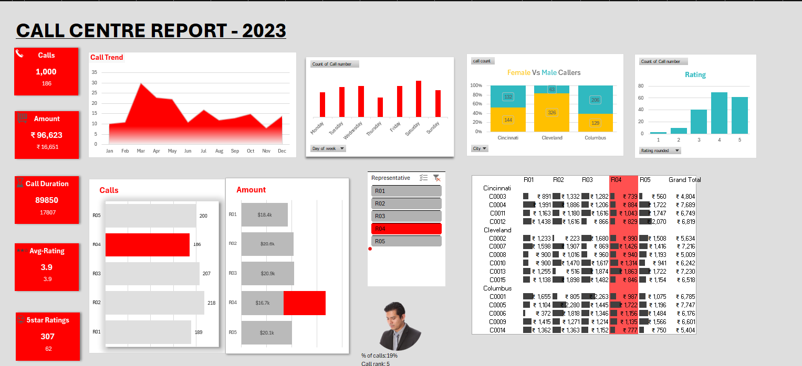

# 📊 Data Analytics Projects 

This repository showcases my data analytics work using **Power BI** and **Excel**, with a focus on visualizing real-world data in an insightful and interactive manner.

---

## 🔷 Power BI Project: Call Centre Dashboard

This Power BI report provides a visual breakdown of call centre metrics such as total calls, agent performance, and call resolution trends.

### 🔗 [View Live Power BI Report](https://app.powerbi.com/groups/me/reports/f611ab1d-33cf-44f9-998f-22c1f28b6f71/8dfd2b73c22b323193ca?experience=power-bi)

**File:** `project.pbix`  
**Data:** Integrated and modeled directly in Power BI  
**Features:**
- Dynamic visual filters
- KPI cards
- Trend analysis using time series

---

## 📈 Excel Project: Call Centre Report

An Excel dashboard developed using pivot tables, slicers, and charts to help analyze call patterns and agent performance.
### 📊 Excel Project

Call Centre Analytics using Excel: [Download Excel Report](call_centre_report.xlsx)

**File:** `call_centre_report.xlsx`  
**Data Handling:**
- Data cleaned and transformed using Excel formulas
- Interactive filtering with slicers
- Visuals like bar charts and pie charts to highlight key metrics

---

## 📁 Project Structure
├── call_centre_report.xlsx # Excel dashboard
├── excel_project.png # Excel dashboard screenshot
├── project.pbix # Power BI project file
├── Screenshot 2025-06-20 120734.png # Power BI screenshot
├── README.md # Project overview and details

